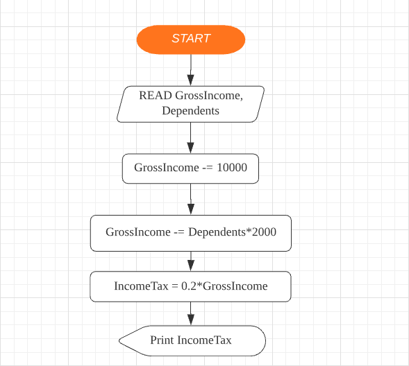

## Q1
#### Pseudocode
````
BEGIN

		READ Mark
 
		CASE Mark
			Mark>69 : PRINT "A"
      
			Mark>59 : PRINT "B"
      
			Mark>54 : PRINT "C"

			Mark>49 : PRINT "D"
    
			Mark>44 : PRINT "E"
     
			Mark>39 : PRINT "S"

			OTHERWISE PRINT "U"
		END-CASE
 
END
````

<br/><br/><br/>

## Q2

#### Flowchart


#### Pseudocode
````
BEGIN

	READ GrossIncome, Dependents
	GrossIncome -= 10000
	GrossIncome -= Dependents*2000
	IncomeTax = 0.2*GrossIncome
	IF IncomeTax<0
		IncomeTax = 0
	ENDIF
	PRINT IncomeTax

END
````
#### Test Plan

Since only John is using the program, we shall assume he doesn't put in abnormal values (ie Negative GrossIncome, Negative Dependents)

| GrossIncome | Dependents | IncomeTax | Notes |
| - | - | - | - |
| 20000 | 0 | 2000 | Normal Data |
| 20000 | 2 | 1200 | Normal Data |
| 5000 | 0 | 0 | Extreme Data: Low GrossIncome |
| 20000 | 6 | 0 | Extreme Data: High Dependents |
